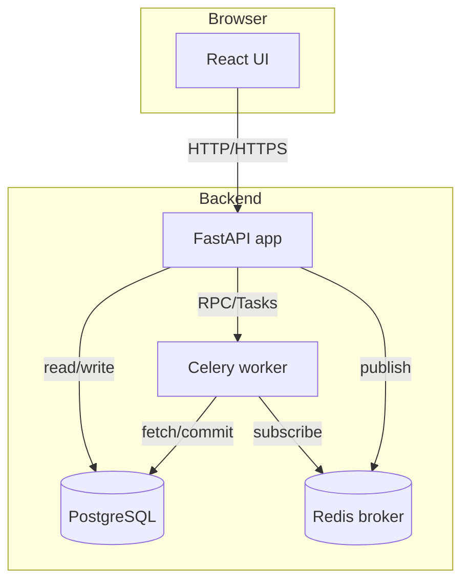

# Architecture

This document describes the overall architecture of the privacy risk
detection platform.  The system is decomposed into several services to
support local deployment, asynchronous processing and a responsive
user interface.

## Overview

piiscope is designed with a two-layer architecture:
1. **Core Package & CLI (`piiscope`)** - A standalone Python library and command-line interface. It handles file parsing, multi-jurisdiction PII detection, metric calculation (k-anonymity, l-diversity, t-closeness), and remediation directly on your machine.
2. **Reference Platform** - A deployable client-server application built on top of the core package, adding a REST API, asynchronous workers, a database, and a React web interface.

### Two-Layer Architecture

```text
+-----------------------------------------------------+
|                  Reference Platform                 |
|                                                     |
|  +-------------+    +---------+    +-------------+  |
|  |  React UI   |--->| FastAPI |--->| Celery Wkr  |  |
|  +-------------+    +---------+    +-------------+  |
|                          |                |         |
+--------------------------|----------------|---------+
                           v                v
+-----------------------------------------------------+
|               piiscope Core (Package & CLI)         |
|                                                     |
|  +-----------+    +-------------+    +-----------+  |
|  | Detection |    |   Metrics   |    | Remediate |  |
|  +-----------+    +-------------+    +-----------+  |
+-----------------------------------------------------+
```

The Reference Platform comprises four main components:

1. **React frontend (`ui` service)** - A single-page application built with React 18 and Material UI. It communicates with the backend via JSON APIs and displays dashboards, risk heatmaps and remediation controls.
2. **REST API (`api` service)** - A FastAPI application exposing endpoints for authentication, profile management, scanning, metrics, redaction, export, reporting and audit logging. It delegates long-running scan jobs to a worker process and stores metadata in a relational database.
3. **Worker (`worker` service)** - A Celery worker that executes resource-intensive scan tasks asynchronously. It reads input files in a streaming fashion, uses the piiscope core engine to identify sensitive data and writes findings back to the database.
4. **Database and broker** - PostgreSQL stores user accounts, sensitivity profiles, scan jobs, findings and audit logs. Redis acts as a message broker and result backend for Celery.

These services are packaged into Docker containers and orchestrated with Docker Compose. By default all data flows remain inside the local network; network egress is blocked at the OS level unless explicitly enabled by a Super Admin.

## Component diagram

The following Mermaid diagram illustrates the high-level component
relationships:



### Data flow

1. **User authentication** - A user accesses the React UI and
   submits login credentials.  The UI sends a POST request to
   `/auth/login`.  The API verifies the password, issues a JWT
   containing the user ID and role, and returns it to the client.
   All subsequent requests include the token in the `Authorization`
   header.
2. **Ingestion and scanning** - The user uploads a CSV/JSON/Parquet
   file through the UI.  The file is streamed to the `/scan/start`
   endpoint along with the chosen sensitivity profile.  The API
   saves an entry in the `ScanJob` table, writes the file to a
   temporary directory and enqueues a Celery task via Redis.
   The Worker receives the task, opens the file using chunked
   parsers and passes each row through the detection engine.  Findings
   (row ID, column name, rule ID, severity, confidence, evidence) are
   accumulated and periodically flushed to the database.  Progress
   percentages are updated on the `ScanJob` record.
3. **Metrics calculation** - Upon completion, the worker computes
   risk scores and anonymization metrics (k-anonymity, l-diversity
   and t-closeness).  These are stored in dedicated tables and
   returned to the UI via `/metrics` endpoints.
4. **Remediation** - Users review findings and choose remediations
   such as hashing or generalisation.  The API applies transformations
   on demand using the masking module and stores an audit trail.
5. **Export and reporting** - When the user clicks “Export”, the API
   writes a sanitised copy of the dataset to disk (CSV/Parquet) and
   records provenance metadata.  Reports are generated by rendering
   an HTML template into PDF, summarizing findings, metrics and
   actions.  The user downloads the report via `/reports/{id}`.

## Data model

The core database entities are:

| Table        | Description |
|--------------|-------------|
| **User**     | Stores the username, hashed password, email and role.  Roles are enumerated (User, Admin, Super Admin). |
| **Profile**  | Contains the name, version, author, YAML/JSON definition of patterns, dictionaries and severity weights. |
| **ScanJob**  | Represents a single scanning session.  Includes job ID, file name, user ID, profile ID, status, progress and timestamps. |
| **Finding**  | Contains a reference to the job ID, record index, column name, rule ID, severity, confidence and evidence sample. |
| **Metric**   | Stores k-anonymity, l-diversity and t-closeness values computed for a job.  Quasi-identifier columns are recorded. |
| **AuditLog** | Immutable log entries with timestamp, user ID, action, target object and details. |

Additional tables maintain masks, remediation decisions and report
metadata.

## Message queue and worker

Celery is configured with Redis as both broker and result backend.
Tasks are acknowledged only when the worker has flushed a batch of
findings to the database, ensuring that long scans are resumable.  The
worker uses the detection engine under `api/detection` and writes
partial results via SQLAlchemy sessions created per task.  When a
task finishes, the `ScanJob` status is updated to “completed” and
metrics are computed.

## Frontend structure

The React app uses React Router for navigation and Context for
authentication state.  Pages include:

* **Login** - Prompt for username/password; send request to `/auth/login`.
* **Upload** - Choose a file or paste text; select a sensitivity profile and start a scan.
* **Dashboard** - Show high-level KPIs (number of findings, risk score, k-anonymity), a trend graph of risk over time and links to recent jobs.
* **Results** - Display a table of findings with filters by severity and confidence; show a heatmap of column risk; allow drill-down to individual records.
* **Profiles** - For Admins and Super Admins: create, view and edit profiles; import/export YAML definitions.
* **Audit logs** - For Super Admins: view audit entries with filters and search.

Styles are based on Material UI, with high-contrast colors for
accessibility.  Chart.js via `react-chartjs-2` renders bar and line
charts, and a custom component draws heatmaps.

## Deployment

Docker Compose orchestrates all services.  The Compose file exposes
port 3000 for the UI and port 8000 for the API.  Environment variables
in `.env` control database credentials, JWT secrets, encryption keys
and optional TLS certificates.  Production deployments can add Nginx
in front of the API and enable mutual TLS between services.

The default Compose configuration runs the application in an offline
mode: external network interfaces are disabled on the containers and
no telemetry is sent.  Administrators may override this behavior by
setting `ALLOW_EGRESS=true` in the environment.